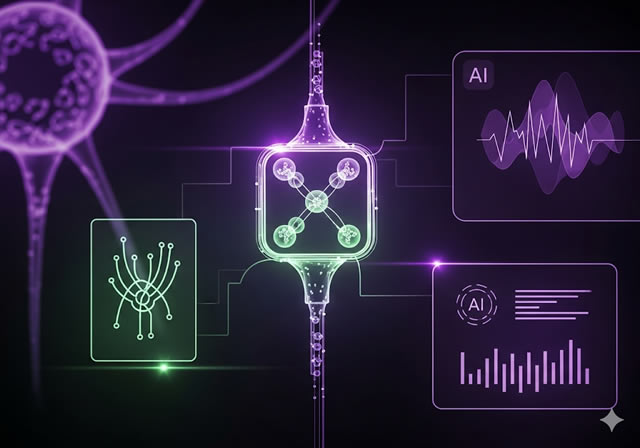

# NeuralGlass Landing Page

A modern, futuristic single-page landing website with a sci-fi neural interface theme.

Built with PHP templates, glassmorphism effects, particle animations, parallax scrolling, and a working contact form (AJAX + backend processing).

  
*(replace with actual screenshot if you add one later)*

## Features

- Responsive design (mobile + desktop)
- Dark futuristic UI with glassmorphism & neon gradients
- Interactive particles background
- Smooth scroll & hover animations
- Contact form with server-side validation & CSRF protection
- PHP-based templating (header/footer separation)

## Tech Stack

- **Frontend**: HTML5, CSS3 (custom + animations), JavaScript (vanilla + fetch)
- **Backend**: PHP 8+
- **Styling**: Custom CSS (~55% of codebase)
- **Assets**: Neural-themed images & icons

## Installation & Local Development

1. Clone the repository:
   ```bash
   git clone https://github.com/MaximusPro/LandingPage.git
   ```
  2. Navigate to the project folder

  ```bash
  cd LandingPage
  ```
  3. Configure config.php:
  ```bash
  <?php
define("ROOT", __DIR__. "/");

define('TELEGRAM_TOKEN',    '1234567890:AAGH0WoHN9vM1IyNyBM4OY$KXCu6Ra6RhJMNF');
define('TELEGRAM_CHAT_ID',  '1234567890');
?> 
```     
4. Start a local PHP server:
```bash
php -S localhost:8000
```
5. Open in browser: http://localhost:8000

## Deployment

Upload all files to any PHP-supporting hosting (shared hosting, VPS, etc.)
Make sure PHP ≥ 7.4 is enabled
Set proper permissions for submit.php (executable)
Recommended: enable HTTPS

## Security Notes

CSRF protection is implemented for the contact form
Use HTTPS in production
Validate & sanitize all inputs on server side
Consider adding reCAPTCHA v3 for better spam protection

## License
MIT License
Feel free to use, modify, and distribute.
## Author
Created by MaximusPro